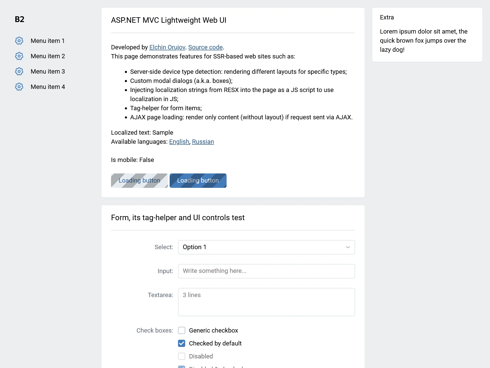
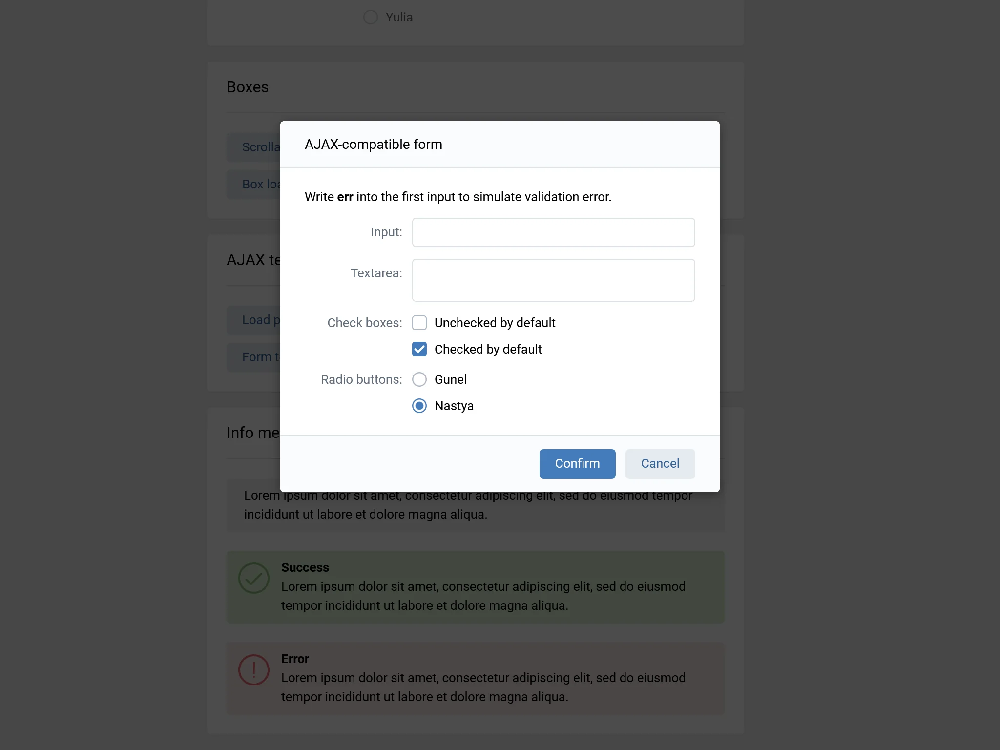
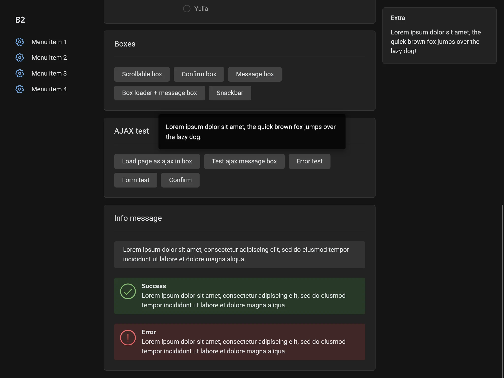
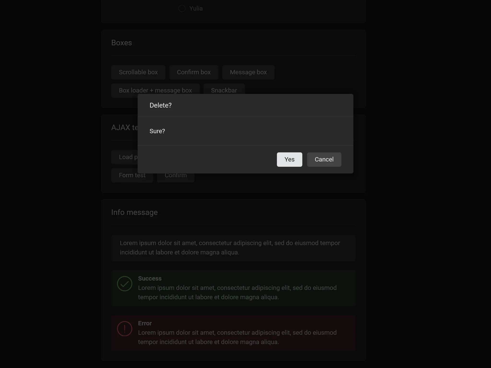
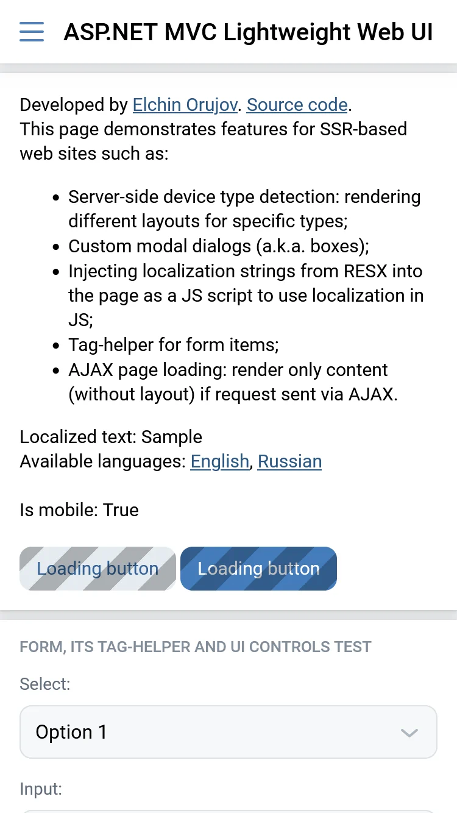
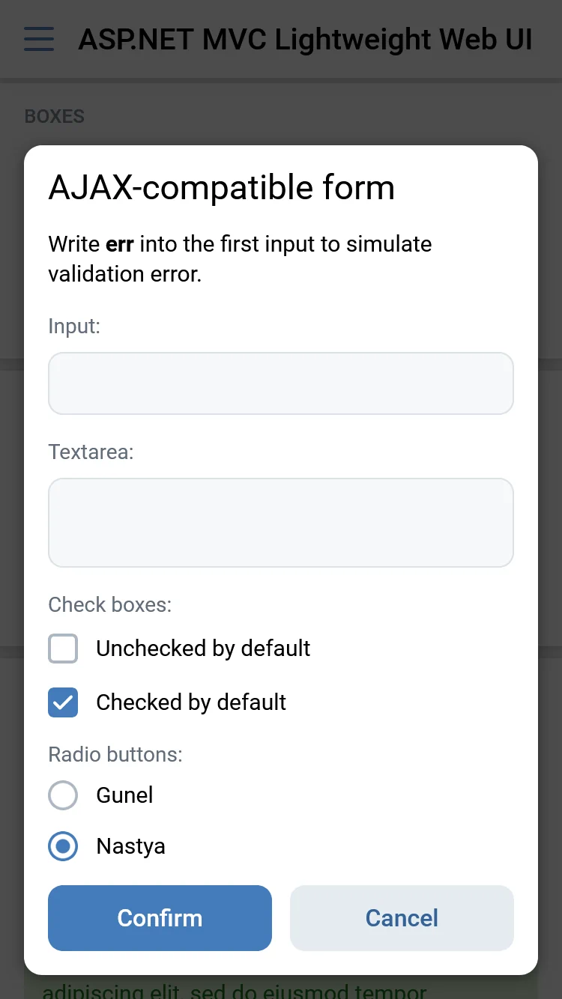
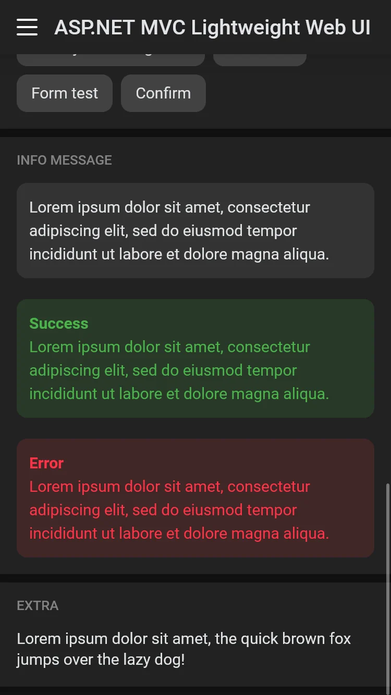
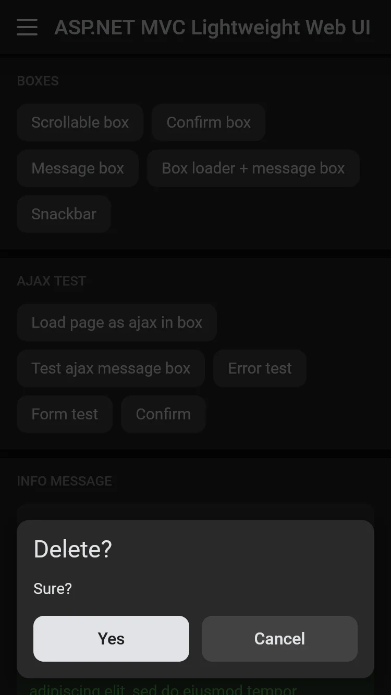

# ASP.NET Core Lightweight Web UI Boilerplate

This is an ASP.NET Core MVC web project (.NET 9) that demonstrates features for SSR-based web sites such as:
* Server-side device type detection: rendering different layouts for specific types;
* Custom modal dialogs (a.k.a. boxes);
* Injecting localization strings from RESX into the page as a JS script to use localization in JS;
* Tag-helper for form items;
* AJAX page loading: render only content (without layout) if request sent via AJAX.

Demo: [elor.top/demos/lwui/](https://elor.top/demos/lwui/)

If you want to develop websites in ASP.NET Core using ыerver-side rendering, you can use this project as a basis.

## For what?

Currently, I developing a ASP.NET Core MVC web-service. I decided that before the service's release, it would be better to share some of my work that isn't directly related to the service but could still be useful to third-party developers. This project is also currently my only publicly available ASP.NET Core project for demonstration to potential employers.

## Inspirations

Some of features, in particular modal dialogs (boxes) and the idea of ​​AJAX commands, were taken from the [Smithereen](https://github.com/grishka/Smithereen) project — a decentralized social network that uses "classical approach" to web site development (server-side rendering without modern UI rendering frameworks like React).

Design of the desktop version inspired by pre-React version of the [vk.com](https://vk.com) (before 2022).  

## Screenshots

### Desktop

### Mobile

